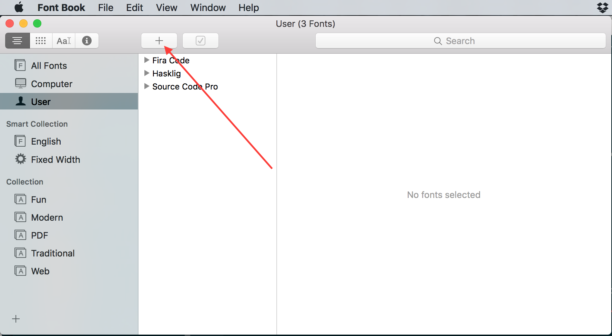

dotfiles
========

Configuration for my command line.

## Setup

### install.sh

This is really all you need to run in order to get my configuration up
and running in your home directory. From a command-line in either Linux
or Mac OSX, you should just be able to run:

```
./install.sh
```

This will:

- Init and update the git submodules (`scm_breeze`, `vim-plug`,
  `hammerspoon-shiftit`, `HS_SpoonsContrib`).
- Symlink everything under `stow/` into `${HOME}` using
  [GNU Stow](https://www.gnu.org/software/stow/) (see "Where things
  live" below).
- Do the same for a sibling `dotfiles-private` repo, if you have one.
- Set up `scm_breeze`.
- Back up and install VIM plugins via `vim-plug`.

It's safe to re-run at any time (e.g. after `git pull`) -- it backs up
any real file it would otherwise clobber (as `<file>_bak`) and just
relinks anything that's already correctly symlinked.

Run `./install.sh --no-vim` to skip the VIM plugin step.

### Re-stowing after adding or moving a file

If all you did was add, remove, or move a file under `stow/`, you don't
need to re-run the whole install (submodules, VIM, etc.) -- just relink:

```
just restow
```

This re-runs GNU Stow for every package (and the `dotfiles-private`
ones too, if that repo is present) without touching submodules or VIM.
See `justfile` for the individual `restow-public` / `restow-private`
recipes.

## Where things live

Everything that gets symlinked into `${HOME}` lives under `stow/`, one
subdirectory per Stow package:

```
stow/bin/bin/*                                     -> ~/bin/*
stow/shell/dot-bashrc                               -> ~/.bashrc
stow/shell/dot-vimrc                                -> ~/.vimrc
stow/shell/dot-tmux.conf                            -> ~/.tmux.conf
stow/bash_profile_includes/dot-bash_profile_includes/*  -> ~/.bash_profile_includes/*
stow/hammerspoon/dot-hammerspoon/*                  -> ~/.hammerspoon/*
```

The path under a package directory is reproduced verbatim under
`${HOME}`, with one twist: any path segment starting with `dot-` is
translated to a leading `.` (e.g. `shell/dot-bashrc` becomes
`~/.bashrc`). This lets dotfiles live in the git repo without every
tool treating them as hidden files.

To add something new:

- **A script for your PATH**: drop it in `stow/bin/bin/` and run
  `just restow`. It'll show up at `~/bin/<name>`.
- **A new dotfile** (e.g. `~/.foorc`): add it to the `shell/` package
  as `stow/shell/dot-foorc`.
- **A new bash profile include**: add it under
  `stow/bash_profile_includes/dot-bash_profile_includes/`; it'll be
  sourced automatically by `.bash_profile`.
- **A brand-new package** (something that shouldn't live under one of
  the above): create `stow/<pkgname>/...` and add `<pkgname>` to the
  package list in `install.sh` (the `stow_with_backup` call) and in
  `justfile`.

## Private dotfile information

There may be cases where you want to have private data used in your
dotfiles that should not end up in a public repo on Github. In this
case, the install script supports a directory (`dotfiles-private`) at
the same place in the file tree as this `dotfiles` directory.

That repo needs the same `stow/` layout as this one -- `install.sh`
stows its `bin`, `shell`, `bash_profile_includes`, and `ssh` packages
the same way it stows this repo's packages, so a file placed there
overrides/extends the corresponding file here. If found, `install.sh`
also imports `dotfiles-private/gpg_key/keyfile` via `gpg --import` and
runs `dotfiles-private/custom-install.sh` if it's executable.

If `dotfiles-private` exists but doesn't yet have a `stow/` directory,
`install.sh` will warn and skip it rather than guessing at the old
layout.

### Fonts on OSX

There are several font packages included here. In order to install any
fonts, you will have to go into *Font Book* to manually import them:



Click on the plus, and choose the folder, and it should import them
correctly. Personally, I've been using Hasklig since it is Source Code
Pro + some ligatures.

### VIM Configuration

The current version uses [vim-plug](https://github.com/junegunn/vim-plug)
to manage VIM plugins. During installation, it will briefly open VIM
to run the plugin installation process. If you'd like to edit the list
of plugins, they are at the bottom of the `.vimrc` file.

This process also assumes you have a valid SSH token for authenticating to
github using SSH.

#### Updating the VIM config

After initial installation, at any time if you would like to update the vim
configuration to the latest versions of the plugins, you just need to run:

```
:PlugUpdate
```

from within VIM, and it will run the process to update all of the plugins.
